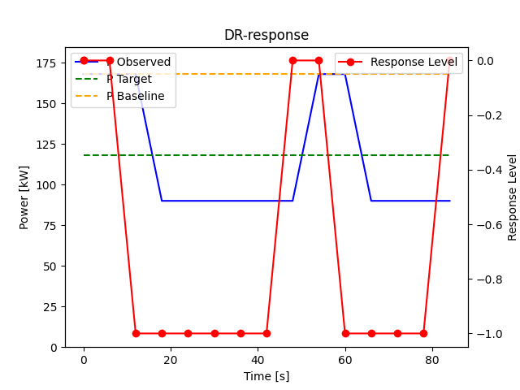

# UC15 Action Coordinator

## Getting started

### Installing packages

Working with poetry, first install poetry on your local machine.

- [poetry installation](https://python-poetry.org/docs/#installation)

Add packages with following command:

    poetry add <package-name>

You can also specify specific version etc. More information on
the [poetry site](https://python-poetry.org/docs/cli/#add).

Run in own environment:

    py -m poetry shell

## Documentation

The hexagon structure of the service can be seen on the picture below.
This is a first version.

## Configuration

The file 'config.yaml' contains the configuration for the service. The file is located in the root of the project.
This section describes the configuration options.

- bau_controller:
    - control_interval_s: The interval in seconds to send out new actions to each device, during Business-As-Usual.
- dr_event:
    - participants: The list of houses that are participating in the DR event.
    - control_interval_s:  The interval in seconds to send out new actions to each device.
- pi_controller:
    - kp: The proportional gain of the PI controller. More information in section 'PI controller'.
    - ki: The integral gain of the PI controller. More information in section 'PI controller'.
- agent:
    - trajectory_length: The length of the trajectory in seconds, used for shaping the input data for the Q-agent.
    - trajectory_interval_s: The interval in seconds to send out new actions to each device, during a DR-event.
    - action_space: The action space of the Q-agent.
- action_dispatcher:
    - enable_dispatch_actions: 1 to enable the action dispatcher, 0 to disable. A disabled action dispatcher results in
      dummy action coordinator, where all the actions are calculated but not sent out to the devices.
    - enable_backup_controller: 1 to enable the backup controller, 0 to disable. A disabled backup controller will not
      send out any actions to the devices.
    - temperature_band: The temperature band in which the backup controller will send out actions.
- house_id_mappings:
    - 'internal':'external': Maps the house id to use internally (logs/ database) to the house id used in the API
      controller (e.g. "House_1: boiler_id_a8:03:2a:4a:35:d0")
- action_mappings:
    - default: The default action mapping for the setpoint action.
    - 'internal':'external': Maps the action to use internally (logs/ database) to the action used in the API controller

## Control States

We briefly touch on the two states the action coordinator can be in:

1. Business-As-Usual (BAU): The action coordinator is in BAU when there is no DR event active. The action coordinator
   will send out actions to the devices every x seconds, where x is defined in the configuration file, please
   see `bau_controller`→`control_interval_s`. At the moment, the actions are binary, either 0 or 1, corresponding to '
   off' and 'on'. When `t_r` is below `t_r_set`, the action is 1, otherwise the action is 0 for a given household.
2. DR event: The action coordinator is in a DR event when there is a DR event active. The action coordinator will send
   out actions to the devices every x seconds, where x is defined in the configuration file, please
   see `dr_event`→`control_interval_s`. The actions that are sent out are a direct result of the response level. A list
   of actions for each response level is defined at the start of each DR event. A PI-Control is used to control the
   response level, which would increase of the power usage is too low, or decrease if the power usage is too high.

So in both states, the action coordinator will send out actions to the devices. The action coordinator will calculate
the actions based on the current state of the devices. After, it sends out the actions to the devices using the boiler
aggregator API.

## PI controller

The PI controller is used to control the response level during a DR event, and is adjustable by its ki and kp gains.
In its current state, the PI controller is adjusted to an expected situation during the field test, described below:

At February 2nd, 2023, at 9:30 am, the following data is captured: the boiler modulation for all 5 trial households, for
the last 24 hours. After, the max modulation level at 'on'-times during the 24 hours was defined:

| House    | Boiler modulation |
|----------|-------------------|
| House_2  | 78                |
| House_9  | 82                |
| House_13 | 78                |
| House_38 | 90                |
| House_42 | 65                |

After, a DR event is simulated on 5 simple boiler emulators. Whenever a boiler receives an 'on' action, it will have a
boiler modulation of the corresponding value in the table; at 'off' times, the boiler modulation will be 0.

The DR event is launched for a power reduction of `-50` for a duration of 15 minutes. The PI controller is visually
tuned
(ad-hoc) to get a result, as shown below. Note that we speeded up the test by 10 times. The actual test took 900 seconds
instead of the 90 seconds that is shown in the graph.

We can observe that after 2 minutes, the response level dropped to negative 1, which induced a fall in observed power
shortly after. Starting from this moment, the PI controller oscilates the response level between 0 and -1 to keep the
observed power around the target power.

The above experiment resulted in the following gains: `kp = 0.01` and `ki = 0.001`.

## Error handling

### Aggregator API failures

During the pilot, the boiler aggregator API was prone to instability. Therefore, the action coordinator has to be able
to handle
API failures at any time. Before going into the details of the error handling, The way the action coordinator handles
API failures is different for BAU and DR event.

#### BAU

When the action coordinator is in BAU, the action coordinator will send out actions to the devices every x seconds,
where x is defined in the configuration file, please see `bau_controller`→`control_interval_s`. If the API fails, the
action
coordinator will retry to send out the actions **at the next control interval**. In the current setup, the retry will be
done at the next control interval, but this can be changed in the future. The number of retries is infinite, but due to
the relatively long control interval, the number of retries is limited in practice.

#### DR event

When the action coordinator is in a DR event, the action coordinator will send out actions to the devices every x
seconds,
where x is defined in the configuration file, please see `dr_event`→`control_interval_s`. If the API fails, the action
coordinator will retry to send out the actions **at the next control interval**. In the current setup, the retry will be
done at the next control interval, but this can be changed in the future. The number of retries is infinite, but due to
the relatively long control interval, the number of retries is limited in practice.

There is one exception to the above. If the DR has just started, the action coordinator tries to retrieve a trajectory
of multiple measurements from the aggregator API. This request is more demanding than the other requests, as it typically has
multiple hours (12 hours for the trial) of data, with higher change on failure. If this request fails, the DR action
cannot be started, as the action coordinator does not have enough information to calculate the actions. In this case,
the DR event is cancelled, and BaU is started again.

